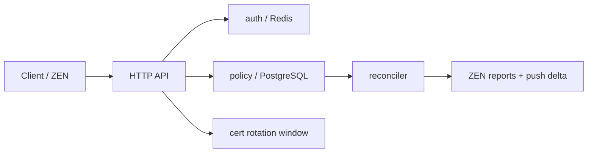

# zen - ZIA Central Authority Simulator

Run the demo server locally (requires PostgreSQL and Redis):

1. Start dependencies with Docker Compose:

```bash
docker-compose up --build
```

2. Build and run the server locally (if you prefer):

```bash
go build ./cmd/server
./server
```

3. Example: create a SAML session

```bash
curl -X POST localhost:8080/api/v1/auth/saml -H "Content-Type: application/json" -d '{"name_id":"janu@acme.com","session_idx":"s001","user_id":"u123","groups":["eng"],"policy_epoch":5,"expires_in_sec":3600,"idp_entity_id":"https://sts.windows.net/abc"}'
```

## Architecture

The simulator is intentionally small and split into four control-plane slices:

- `auth` owns SAML session caching, epoch invalidation, user deprovisioning, and the API key obfuscation helper.
- `policy` owns the PostgreSQL-backed policy store and the reconciler that detects ZEN drift and pushes deltas.
- `cert` owns the dual-cert rotation window used during CA updates.
- `cmd/server` wires HTTP handlers, Redis, PostgreSQL, and the background reconciler together.

Request flow at a glance:



Operationally, the key invariants are:

- SAML sessions expire by TTL and are invalidated when the policy epoch advances.
- Policy changes are append-only and serve as the source of truth for drift detection.
- ZEN reports are compared against the current epoch; drift beyond the threshold triggers a delta push.
- Cert rotation preserves an overlap window so old and new trust material can coexist briefly.

## Interview Questions

Use these to rehearse the architecture and tradeoffs:

1. Where are the real consistency boundaries in this design, and which ones are acceptable to make eventually consistent?
2. If Redis, PostgreSQL, and the reconciler disagree, what is the source of truth and how do you prove it under failure?
3. How would you redesign epoch propagation so a stale ZEN can never serve policy older than a safety window?
4. What invariants would you enforce around SAML session issuance, policy changes, and user deprovisioning to prevent privilege resurrection?
5. How would you make policy deltas idempotent, replay-safe, and order-aware if the same event is delivered multiple times?
6. What would you change if policy writes needed to handle thousands of tenants and bursty admin updates without increasing drift?
7. Where would you place backpressure, retries, and circuit breakers so auth, policy, and reconciliation degrade independently instead of taking each other down?
8. How would you instrument this system to distinguish data bugs from infrastructure bugs within one incident timeline?
9. If you had to support active-active regions, what would you replicate synchronously, what would you replicate asynchronously, and why?
10. What design tradeoff here would you keep even if it looked less elegant, because it reduces operational risk in production?
