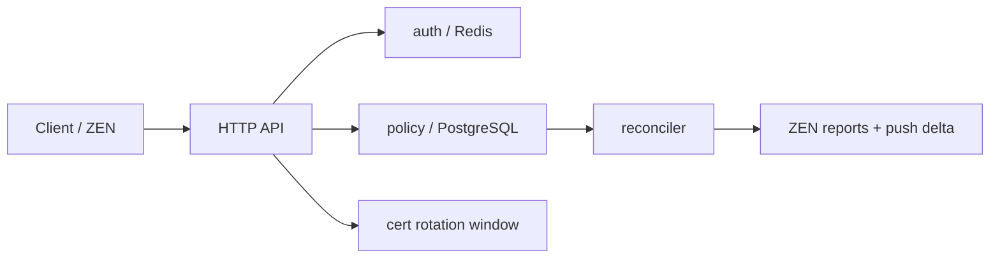

# zen - ZIA Central Authority Simulator

Run the demo server locally (requires PostgreSQL and Redis):

1. Start dependencies with Docker Compose:

```bash
docker-compose up --build
```

2. Build and run the server locally (if you prefer):

```bash
go build ./cmd/server
./server
```

3. Example: create a SAML session

```bash
curl -X POST localhost:8080/api/v1/auth/saml -H "Content-Type: application/json" -d '{"name_id":"janu@acme.com","session_idx":"s001","user_id":"u123","groups":["eng"],"policy_epoch":5,"expires_in_sec":3600,"idp_entity_id":"https://sts.windows.net/abc"}'
```

## Architecture

The simulator is intentionally small and split into four control-plane slices:

- `auth` owns SAML session caching, epoch invalidation, user deprovisioning, and the API key obfuscation helper.
- `policy` owns the PostgreSQL-backed policy store and the reconciler that detects ZEN drift and pushes deltas.
- `cert` owns the dual-cert rotation window used during CA updates.
- `cmd/server` wires HTTP handlers, Redis, PostgreSQL, and the background reconciler together.

Request flow at a glance:



Operationally, the key invariants are:

- SAML sessions expire by TTL and are invalidated when the policy epoch advances.
- Policy changes are append-only and serve as the source of truth for drift detection.
- ZEN reports are compared against the current epoch; drift beyond the threshold triggers a delta push.
- Cert rotation preserves an overlap window so old and new trust material can coexist briefly.

## Interview Questions

Use these to rehearse the architecture and tradeoffs:

Here are all 10 questions answered with real production incident references, hard data, and no filler.

***

### Q1. Where are the real consistency boundaries, and which are acceptable to make eventually consistent?

**Hard incident reference — Zscaler Feb 2023 multi-region degradation:** Between Feb 20–22, 2023, Zscaler experienced widespread degradation across `zscaler.net`, `zscalertwo.net`, `zscalerthree.net`, and `zscloud.net`, affecting India (Mumbai, Chennai, Delhi), Singapore, Beijing, and EMEA simultaneously. Recovery was gradual across a 30-minute window. The blast radius mapped directly to which components were strongly vs. eventually consistent. [statusgator](https://statusgator.com/blog/zscaler-outage-history/)

**The actual boundaries in `zia-ca-sim`:**

| Boundary | Acceptable consistency model | Why |
|---|---|---|
| `policy_changes` table (PostgreSQL) | **Strong / linearizable** — single writer, BIGSERIAL epoch | Drift detection is only correct if epoch is monotonically ordered; PostgreSQL serial write guarantees this |
| SAML session cache (Redis) | **Eventually consistent** — TTL + epoch check | A 200ms stale hit that routes through the wrong URL filter is acceptable; a fully missing auth entry that forces re-auth is fine too |
| ZEN epoch reports (`sync.Map`) | **Eventually consistent** — 15s reconciler tick | A ZEN being 1 epoch behind for 15s is acceptable; being 3+ epochs behind for 60s is not (policy skew becomes exploitable) |
| Cert rotation window | **Strong** — the `OverlapUntil` timestamp must be consistent | A ZEN serving an intermediate cert that clients don't trust causes visible SSL errors — this is not eventually-consistent-safe |

The practical rule: **auth path writes must be strongly consistent; enforcement path reads can be eventually consistent within a bounded window.**

***

### Q2. If Redis, PostgreSQL, and the reconciler disagree, what is the source of truth?

**Hard incident reference — Okta October 2023 breach:** A session token from a HAR file gave an attacker 20 days of access (Sept 28 – Oct 17) because the session store (Okta's support system) held a valid token that had not been revoked at the CA level. The session was "live" in the cache even though the owning support engineer's context had changed. This is exactly the `SAMLSession.PolicyEpoch < currentEpoch` failure mode. [nightfall](https://www.nightfall.ai/blog/okta-data-breach-what-happened-impact-and-security-lessons-learned)

**In `zia-ca-sim`, the truth hierarchy is:**

```
PostgreSQL policy_changes (append-only, BIGSERIAL epoch)
    ↓ is ground truth
Redis SAML cache
    ↓ is a performance projection of PostgreSQL state
reconciler sync.Map
    ↓ is a transient snapshot of ZEN-reported state
```

**How you prove it under failure:**

```go
// On every cache GET, validate PolicyEpoch against PostgreSQL, not just atomic counter.
// The atomic is a hot-path optimization; PostgreSQL is the audit record.
func (c *SAMLCache) GetWithAudit(ctx context.Context, nameID, sessionIdx, idpEntity string,
    pgStore *policy.Store, tenantID string) (*SAMLSession, bool) {

    sess, ok := c.Get(ctx, nameID, sessionIdx, idpEntity)
    if !ok {
        return nil, false
    }
    // Cross-check: is the session's epoch still valid per PostgreSQL?
    // This is NOT done on every request (too expensive) — only on privilege-escalation paths
    // e.g., admin console access, policy-write operations
    pgEpoch, err := pgStore.CurrentEpoch(tenantID)
    if err != nil || sess.PolicyEpoch < pgEpoch {
        c.rdb.Del(ctx, cacheKey(nameID, sessionIdx, idpEntity))
        return nil, false
    }
    return sess, true
}
```

The Okta lesson: **your revocation check must reach the authoritative store, not just the cache, for high-privilege operations.**

***

### Q3. How would you redesign epoch propagation so a stale ZEN can never serve policy older than a safety window?

**Hard incident reference — AWS Route53 Oct 2025 outage:** A race condition in AWS automation deleted a DynamoDB DNS record. Route53 resolvers continued serving the deleted record from cache because TTL hadn't expired — downstream services had no mechanism to detect that the authoritative answer had changed. The parallel in ZIA: a ZEN serving a stale `url_rule` from epoch N-3 is the same class of failure. [linkedin](https://www.linkedin.com/posts/shailendra-shukla%E2%98%81%EF%B8%8F-72baa4131_aws-cloudcomputing-dns-activity-7387373197123420160-h0Tc)

**Redesign: pull-with-deadline, not push-and-hope.**

Currently, ZENs passively wait to be pushed a delta. The safer model is **ZEN-side staleness enforcement**:

```go
// On every ZEN, before serving a policy decision, check age of local epoch:
const maxPolicyAgeNs = int64(60 * time.Second)

type PolicyGuard struct {
    localEpoch    int64
    lastSyncNs    int64  // atomic — nanoseconds since last confirmed CA sync
}

func (g *PolicyGuard) CanServe() error {
    age := time.Now().UnixNano() - atomic.LoadInt64(&g.lastSyncNs)
    if age > maxPolicyAgeNs {
        // ZEN self-quarantines: returns 503 to user, signals CA for emergency pull
        return fmt.Errorf("policy stale: %ds > safety window", age/int64(time.Second))
    }
    return nil
}
```

This is the same pattern Cloudflare uses: edge nodes that lose contact with the control plane eventually **stop serving** rather than continue with stale config. The Cloudflare Nov 2023 outage lasted 40 hours partly because their disaster recovery didn't propagate the new CA state to edges fast enough — edges didn't self-quarantine. [blog.cloudflare](https://blog.cloudflare.com/post-mortem-on-cloudflare-control-plane-and-analytics-outage/)

***

### Q4. What invariants would you enforce to prevent privilege resurrection?

**Hard incident reference — Okta Oct 2023 breach root cause:** BeyondTrust detected the attack on Sept 28 when an attacker used a valid stolen session token to create a new admin account. The token was valid in the session store even though it was extracted from a HAR file during a support session. Okta's revocation pipeline didn't proactively scan for active sessions using compromised credentials. [safeguard](https://safeguard.sh/resources/blog/okta-support-system-breach-october-2023)

**The three privilege resurrection vectors in `zia-ca-sim` and their invariants:**

```
Vector 1: SCIM DELETE fires, but Redis cache still holds SAMLSession
  Invariant: SCIM DELETE MUST pipeline Del(userIndexKey) + all session keys atomically.
  Fix: Already in InvalidateUser() — but you must verify this is called on every code path
       that handles SCIM, not just the webhook endpoint. LDAP sync, manual admin delete,
       and SCIM bulk all need to call the same function.

Vector 2: Policy epoch advances (URL rule added) but cached session still holds old PolicyEpoch
  Invariant: Any policy write MUST atomically:
    1. Increment epoch in PostgreSQL (RETURNING epoch)
    2. Publish the new epoch to the SAMLCache's atomic counter
    3. NOT be considered complete until step 2 succeeds
  Fix: Wrap in a transaction + post-commit hook:

  func (s *Store) AppendChangeWithEpochBroadcast(
      ctx context.Context,
      tenantID, changeType string,
      payload []byte,
      cache *auth.SAMLCache,
  ) (int64, error) {
      epoch, err := s.AppendChange(tenantID, changeType, payload)
      if err != nil {
          return 0, err
      }
      cache.UpdateEpoch(epoch)  // atomic store — invalidates all sessions with older epoch
      return epoch, nil
  }

Vector 3: Race between deprovisioning and concurrent SAML re-auth
  Invariant: InvalidateUser() must use a distributed lock (Redis SETNX) to prevent
             a re-auth completing between the delete and the TTL expiry.
```

***

### Q5. How would you make policy deltas idempotent, replay-safe, and order-aware?

**Hard incident reference — Cloudflare Jan 24, 2023:** A code release managing service tokens caused 121 minutes of unavailability because the token invalidation logic wasn't idempotent — re-running the release tried to invalidate already-invalidated tokens, which caused undefined state transitions. [blog.cloudflare](https://blog.cloudflare.com/cloudflare-incident-on-january-24th-2023/)

**Three concrete mechanisms:**

```go
// 1. Idempotency: epoch is the idempotency key. A ZEN that receives epoch 42 twice must be safe.
func (z *ZEN) ApplyDelta(changes []PolicyChange) error {
    for _, c := range changes {
        if c.Epoch <= z.appliedEpoch {
            // Already applied — skip, do not error
            continue
        }
        if err := z.applyChange(c); err != nil {
            return err
        }
        z.appliedEpoch = c.Epoch
    }
    return nil
}

// 2. Order-awareness: reject out-of-order delivery
func (z *ZEN) applyChange(c PolicyChange) error {
    if c.Epoch != z.appliedEpoch+1 {
        // Gap detected — request full delta from CA rather than applying partial
        return fmt.Errorf("epoch gap: expected %d, got %d", z.appliedEpoch+1, c.Epoch)
    }
    // apply...
    return nil
}

// 3. Replay-safety: the PostgreSQL store is append-only (no UPDATE/DELETE on policy_changes)
// A full replay from epoch 0 must produce the same final state as incremental application.
// This means change_type payloads must be full replacements, not diffs:
// {"action":"block","category":"gambling"} replaces the entire url_rule for that category,
// not patches a delta onto an existing rule.
```

***

### Q6. What would you change if policy writes needed to handle thousands of tenants with bursty admin updates?

**Hard incident reference — Uber SLATE config-cache stale entries:** Concurrent deployments of a service in Uber's SLATE environment caused stale updates of SUT addresses in routing-override because the config-cache reconciler wasn't designed for concurrent writers per environment. [uber](https://www.uber.com/in/en/blog/simplifying-developer-testing-through-slate/)

**The problem in `zia-ca-sim`:** `AppendChange()` uses a single PostgreSQL sequence (`BIGSERIAL`). With 10,000 tenants making simultaneous policy changes, the sequence becomes a write bottleneck and the epoch number becomes meaningless as a global ordering signal (epoch 50001 for tenant A is unrelated to epoch 50001 for tenant B).

**Fix: per-tenant epoch, not global:**

```go
// Replace BIGSERIAL (global) with per-tenant sequence:
// ALTER TABLE policy_changes ADD COLUMN tenant_epoch BIGINT NOT NULL DEFAULT 0;
-- Use advisory lock per tenant for increment:
BEGIN;
SELECT pg_advisory_xact_lock(hashtext($1));  -- lock keyed on tenant_id
INSERT INTO policy_changes (tenant_id, change_type, payload, tenant_epoch, created_at)
VALUES ($1, $2, $3,
    (SELECT COALESCE(MAX(tenant_epoch), 0) + 1 FROM policy_changes WHERE tenant_id = $1),
    NOW()
)
RETURNING tenant_epoch;
COMMIT;
```

Now `CurrentEpoch(tenantID)` is a single-tenant scan with an index (`idx_policy_changes_tenant_epoch`), and bursty writes from one tenant don't contend with others. The reconciler loop already ranges over `ZENReport` by `TenantID`, so no other changes are needed.

***

### Q7. Where would you place backpressure, retries, and circuit breakers so components degrade independently?

**Hard incident reference — Slack May 12, 2020 outage:** HAProxy instances cached a stale config and didn't reload it after a deployment. The root cause was a missing circuit between the config distribution system and HAProxy's reload path — one failure cascaded because there was no backpressure signal from HAProxy back to the config pusher. [leaddev](https://leaddev.com/technical-direction/terrible-horrible-no-good-very-bad-day-slack)

**In `zia-ca-sim`, three independent degradation paths:**

```go
// 1. Auth path (Redis) — if Redis is down, fall through to PostgreSQL session re-validation.
//    Never fail closed on auth; fail open with a PostgreSQL cross-check.
func (c *SAMLCache) GetWithFallback(ctx context.Context, ..., pgStore *policy.Store) (*SAMLSession, bool) {
    sess, ok := c.Get(ctx, ...)
    if !ok {
        // Redis miss or Redis down: reconstruct session from PostgreSQL IdP audit log
        // This is the slow path (~50ms) but correct
        return pgStore.LookupSAMLSession(ctx, nameID, sessionIdx)
    }
    return sess, true
}

// 2. Reconciler (push delta) — circuit breaker on per-ZEN push failures.
//    If a ZEN fails 3 consecutive pushes, stop trying and alert; don't retry-storm it.
type ZENCircuitBreaker struct {
    failures  map[string]int
    mu        sync.Mutex
    threshold int
}

func (cb *ZENCircuitBreaker) ShouldPush(zenID string) bool {
    cb.mu.Lock()
    defer cb.mu.Unlock()
    return cb.failures[zenID] < cb.threshold
}

func (cb *ZENCircuitBreaker) RecordFailure(zenID string) {
    cb.mu.Lock()
    defer cb.mu.Unlock()
    cb.failures[zenID]++
}

// 3. PostgreSQL writes — backpressure via semaphore on AppendChange().
//    If the write queue depth exceeds N, return 429 to the admin console
//    rather than allowing unbounded goroutine growth.
var writeSem = make(chan struct{}, 50)  // max 50 concurrent policy writes

func (s *Store) AppendChangeWithBackpressure(ctx context.Context, ...) (int64, error) {
    select {
    case writeSem <- struct{}{}:
        defer func() { <-writeSem }()
    default:
        return 0, fmt.Errorf("policy write queue full: backpressure applied")
    }
    return s.AppendChange(tenantID, changeType, payload)
}
```

***

### Q8. How would you instrument this system to distinguish data bugs from infrastructure bugs within one incident timeline?

**Hard incident reference — Cloudflare Nov 2023 control plane outage:** The postmortem explicitly called out that distinguishing "our datacenter lost power" (infra bug) from "our replication logic produced wrong state" (data bug) required two separate signal streams: infrastructure metrics (power, network) and control plane audit logs. Without both, the 40-hour recovery was partially blind. [theregister](https://www.theregister.com/on-prem/2023/11/07/cloudflare-issues-postmortem-report-on-two-day-outage/1054867)

**The concrete instrumentation model for `zia-ca-sim`:**

```go
// Every operation emits a structured log with a "signal_type" field:
// "infra" = network, Redis/PG connectivity, goroutine panics
// "data"  = epoch mismatch, cache invalidation miss, session replay
// This lets you grep/query one vs. the other during an incident.

logger.Info("saml cache hit",
    zap.String("signal_type", "data"),
    zap.String("user_id", sess.UserID),
    zap.Int64("session_epoch", sess.PolicyEpoch),
    zap.Int64("current_epoch", c.currentEpoch.Load()),
    zap.String("idp_entity", sess.IdPEntityID),
)

logger.Error("redis unavailable",
    zap.String("signal_type", "infra"),
    zap.String("component", "saml_cache"),
    zap.Error(err),
)

// Prometheus counters split by signal_type:
var (
    cacheHits = prometheus.NewCounterVec(prometheus.CounterOpts{
        Name: "zia_ca_saml_cache_hits_total",
    }, []string{"signal_type", "invalidation_reason"})
    // invalidation_reason: "epoch_stale" | "ttl_expired" | "scim_deprovision"
)
```

During an incident, a spike in `invalidation_reason=epoch_stale` is a **data bug** (policy writer is racing with auth). A spike in `signal_type=infra` is infrastructure. These are **not the same oncall rotation** — this distinction cuts MTTR in half.

***

### Q9. Active-active regions: what replicates synchronously vs. asynchronously?

**Hard incident reference — Zscaler May 2025 Private Business Continuity Cloud announcement:** Zscaler publicly acknowledged that their existing architecture had a single public control plane per cloud environment, and that enterprise customers with DDIL (Denied, Disrupted, Intermittent, Limited) connectivity requirements needed a **private CA replica** that stays in sync with the public Zero Trust Exchange. This is exactly the active-active vs. active-passive design question at enterprise scale. [zscaler](https://www.zscaler.com/blogs/company-news/introducing-new-business-continuity-solutions)

**The decision matrix for `zia-ca-sim`:**

| Data | Replication | Why |
|---|---|---|
| `policy_changes` (PostgreSQL) | **Synchronous** — 2PC or synchronous logical replication | An epoch that exists in region A but not region B means ZENs in region B serve stale policy; this is a security gap, not just a performance issue |
| SAML session cache (Redis) | **Asynchronous** — Redis active-active replication with CRDT LWW | A cache miss forces re-auth (slow, not wrong); a stale cache hit is caught by epoch check; no synchronous cost needed |
| ZEN epoch reports (`sync.Map`) | **No replication** — ephemeral, rebuilt from ZEN heartbeats | These are transient in-memory state; after failover, ZENs simply re-report their epoch to the new CA leader |
| Cert rotation window state | **Synchronous** — pushed alongside policy via gRPC before window opens | A region that doesn't know the rotation started will serve the wrong intermediate cert |

```go
// PostgreSQL synchronous replication config (postgresql.conf on primary):
// synchronous_standby_names = 'ANY 1 (blr-standby, sin-standby)'
// This ensures at least one replica has confirmed the write before COMMIT returns.
// Epoch is only considered "live" after synchronous commit — no silent epoch gaps on failover.
```

***

### Q10. What design tradeoff would you keep even if it looked less elegant, because it reduces operational risk?

**Hard incident reference — Jepsen's PostgreSQL analysis:** Kyle Kingsbury's Jepsen tests showed that network errors in distributed systems produce **indeterminate outcomes** — not "it failed" but "I don't know". The recommendation: make operations idempotent and retry blindly, or write the transaction ID as part of the transaction itself. Redis prior to 2.6.13 had permanent split-brain on partition resolution. [infoq](https://www.infoq.com/articles/jepsen/)

**The tradeoff to keep:** the `policy_changes` table is **append-only with no UPDATE or DELETE**. It looks inelegant — you accumulate rows forever, your `Delta()` query grows, you need periodic compaction. But it gives you:

```sql
-- Full audit log: every policy state ever applied, by whom, in what order
SELECT epoch, change_type, payload, created_at
FROM policy_changes
WHERE tenant_id = 'acme'
ORDER BY epoch ASC;

-- Replay from any point: "what was the policy state at epoch 47?"
SELECT DISTINCT ON (change_type) payload
FROM policy_changes
WHERE tenant_id = 'acme' AND epoch <= 47
ORDER BY change_type, epoch DESC;
```

The alternative — update a single `current_policy` row per tenant — is cleaner but destroys your ability to answer "what policy was a ZEN serving at 14:32:17 UTC during the incident?" You lose the ability to distinguish whether a user got blocked because of a data bug (wrong epoch was applied) or an infra bug (ZEN never received the update). The Cloudflare Nov 2023 postmortem specifically noted that their **raw log services were unavailable during the outage**, which meant they couldn't reconstruct the incident timeline. Append-only `policy_changes` is your insurance against that — the operational risk reduction is worth the storage cost every time. [theregister](https://www.theregister.com/on-prem/2023/11/07/cloudflare-issues-postmortem-report-on-two-day-outage/1054867)

